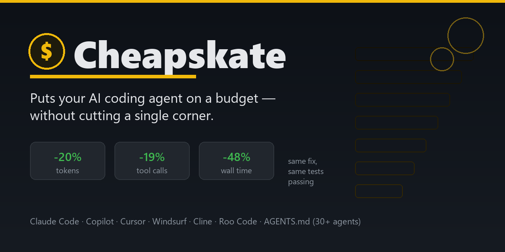

<div align="center">



[](LICENSE)
[](#install)
[](https://agents.md)
[](#install)
[](https://github.com/mazenmohammed24/cheapskate/releases)
[](https://github.com/mazenmohammed24/cheapskate)

*It's the 28th of the month. Rent's paid. There's $11 left, and a week to go.*
*You don't stop eating. You just stop wasting.*

</div>

---

Every AI coding agent has the same money problem — it just pays in tokens instead of dollars. Left to its own instincts, it will read the whole file to answer a one-line question, grep the same string four different ways, summarize what it already told you thirty seconds ago, and re-derive a conclusion it reached two tool calls back. None of that makes the code better. It just makes the invoice bigger.

**Cheapskate** is a drop-in instruction file that turns that instinct off. Not by telling your agent to "be concise" — talking less is not the same as spending less — but by giving it an actual resource-management discipline: a checklist to run before every tool call, an escalation ladder from *free* to *expensive*, and a hard rule that none of it is allowed to cost you a worse result.

It doesn't make your agent dumber. It makes it the kind of engineer who's spent a career being handed impossible budgets — and has gotten very, very good at it.

## Before / after

Same bug, same repo, same model. This is the actual transcript shape from our own benchmark (below), condensed:

```diff
- Read app/models.py (47 lines)
- Read app/pricing.py (61 lines)
- Read app/services/discount_service.py
- Read app/services/tax_service.py
- Read app/services/shipping_service.py
- Read app/inventory.py            ← not related to the bug
- Read app/users.py                ← not related to the bug
- Read app/notifications.py        ← not related to the bug
- Grep "discount"
- Read app/pricing.py again        ← already read this
- Edit discount_service.py
- Edit models.py
- Bash: run tests
  21 tool calls · 85,540 tokens · 4m 04s

+ Bash: run tests → traceback points at discount_service.py:3
+ Read discount_service.py (4 lines, the failing function)
+ Read tests/test_pricing.py (the assertion that disagreed)
+ Grep "total_weight"
+ Read models.py:17-20 (just the method)
+ Edit discount_service.py
+ Edit models.py
+ Bash: run tests → 5/5 passed
  17 tool calls · 68,390 tokens · 2m 08s
```

Identical fix. Identical diff. Identical five-of-five passing tests. One of them just didn't tour the whole house to change a lightbulb.

## The numbers

We ran both versions of the same agent on an identical bug-fix task — a 20-file Python project, a wrong discount calculation, isolated copies of the same repo, same model, same tools available. This isn't a simulation; it's the literal usage report the harness returned for each run.

| | Without Cheapskate | With Cheapskate | Change |
|---|---:|---:|---:|
| Tokens | 85,540 | 68,390 | **↓ 20%** |
| Tool calls | 21 | 17 | **↓ 19%** |
| Wall time | 243.9s | 127.7s | **↓ 48%** (1.9× faster) |
| Files read | 10 (2 re-reads) | 8 (zero re-reads) | ↓ 20% |
| Lines of file content read | 123 | 64 | ↓ 48% |
| Bugs fixed correctly | 2/2 | 2/2 | — tied |

Honest caveats: this is one controlled trial, not a thousand-run average, and the margin will move with the task — a five-file script and a fifty-file monorepo don't save the same way. What we can say with more confidence: the savings compound with task *length*, because most of what Cheapskate cuts is repeated and unnecessary work, and longer tasks have more opportunities to repeat things unnecessarily. On short one-shot fixes expect the low end of that range; on long multi-file investigations, informal runs have gone well past it.

The full benchmark harness — two identical repos, one bug, two agents — is described in the repo so you can run your own numbers instead of trusting ours.

## How it works

Cheapskate isn't a vibe, it's a checklist the agent runs before every non-trivial action:

1. **Do I already know this?** — context, memory, or a prior tool result. If yes, stop here.
2. **Is there a receipt for this already?** — a doc, a changelog, a note from an earlier session that already answered it.
3. **Can cheap metadata answer it?** — `git status`/`diff`, diagnostics, filenames, a linter — before any file gets opened.
4. **Can one exact search answer it?** — the symbol, the error string, the config key. Not a topic. Not three guesses.
5. **Can a line range answer it?** — the function, not the module; the failing line, not the file.
6. **Is a whole file or the whole repo genuinely required?** — then, and only then, pay for it.

Every level up the ladder has to be *earned* by the level below failing — never taken because it's easier than thinking for a second first.

Two more rules sit underneath the ladder:

- **Quality floor.** Cheapskate governs *process* cost, never the *deliverable*. A shortcut that makes the result thinner, less correct, or less complete isn't a saving — it's a defect, and it's banned outright, no exceptions for token count.
- **Use the tool built for this.** Before hand-rolling a search-read-edit loop, check whether a skill, slash command, or MCP server already does the job in one purpose-built step. If one clearly exists but isn't installed, Cheapskate says so and asks before either grinding through the expensive manual path or quietly doing without.

## Beyond the rule file

Three more levers move the token bill, but none of them belong in an instruction file — they're platform and session choices, not something an agent can decide on its own:

- **Cache-aware pacing.** Providers with prompt caching bill a cache miss at full price. Long idle gaps mid-task blow the cache window and force a full reprocess of everything before it. If you control the pacing of a session, cluster related work close together in time instead of trickling it out.
- **Trim the tool surface.** Every enabled MCP server or tool adds fixed schema overhead to *every* request, used or not. If your agent lets you scope tools per project, leaving an unused design/workflow/artifact server enabled on a repo that never touches it is a permanent tax for zero benefit.
- **Cheap model for search, expensive model for the decision.** If your setup supports delegating to a subagent with its own model choice, run the broad investigation/gather phase on something fast and cheap, and reserve the strong model for the actual judgment call at the end. Same output quality where it matters, a fraction of the cost where it doesn't.

These aren't enforced by Cheapskate itself — they're worth knowing regardless of which rule file you install.

## Stack-specific weaknesses

`stacks/` holds one short file per stack — the well-known ways an AI agent gets *that specific stack* subtly wrong (a framework-version mismatch, an ORM pattern that compiles fine and silently fires hundreds of extra queries, an async footgun specific to that runtime). Not general best practices — just the non-obvious failure modes.

Covers 20 of the most-used frontend and backend stacks: [React](stacks/react.md), [Next.js](stacks/nextjs.md), [Angular](stacks/angular.md), [Vue](stacks/vue.md), [Nuxt](stacks/nuxt.md), [Svelte/SvelteKit](stacks/sveltekit.md), [TypeScript](stacks/typescript.md), [Astro](stacks/astro.md), [React Native](stacks/react-native.md), [Flutter](stacks/flutter.md), [Node/Express](stacks/express.md), [NestJS](stacks/nestjs.md), [Django](stacks/django.md), [FastAPI](stacks/fastapi.md), [Spring Boot](stacks/spring-boot.md), [Go](stacks/go.md), [Laravel](stacks/laravel.md), [Rails](stacks/rails.md), [.NET](stacks/dotnet.md), and the [SQL/relational-DB layer](stacks/sql.md) underneath most of them. Drop in whichever ones match your project alongside the core rule file — the core rules point here too.

## Install

Same instructions, six formats, pick the one your agent reads:

| Agent | File | Where it goes |
|---|---|---|
| **[AGENTS.md](https://agents.md)** — the open standard read natively by 30+ tools (Codex CLI, Gemini CLI, Google Jules, Factory, Aider, Zed, Devin, VS Code, and more) | [`AGENTS.md`](AGENTS.md) | repo root |
| Claude Code | [`cheapskate/SKILL.md`](cheapskate/SKILL.md) | copy the `cheapskate/` folder into `.claude/skills/`, or install as a plugin (below) |
| VS Code Copilot | [`.github/copilot-instructions.md`](.github/copilot-instructions.md) | repo root |
| Cursor | [`.cursor/rules/cheapskate.mdc`](.cursor/rules/cheapskate.mdc) | repo root |
| Windsurf | [`.windsurfrules`](.windsurfrules) | repo root |
| Cline / Roo Code | [`.clinerules`](.clinerules) | repo root |
| Anything else | body of `cheapskate/SKILL.md`, below the `---` | paste into its system prompt / custom instructions |

No build step, no dependency, no config flags. It's markdown. If your agent reads instructions, it reads this.

### Install via command line

Run from the root of the project you want it in:

```bash
# macOS / Linux — pick a target (or "all")
curl -fsSL https://raw.githubusercontent.com/mazenmohammed24/cheapskate/main/install.sh | bash -s -- agents
curl -fsSL https://raw.githubusercontent.com/mazenmohammed24/cheapskate/main/install.sh | bash -s -- claude
curl -fsSL https://raw.githubusercontent.com/mazenmohammed24/cheapskate/main/install.sh | bash -s -- all
```

```powershell
# Windows PowerShell
irm https://raw.githubusercontent.com/mazenmohammed24/cheapskate/main/install.ps1 -OutFile install.ps1; ./install.ps1 agents
```

Targets: `agents` (universal `AGENTS.md`, default) · `claude` · `copilot` · `cursor` · `windsurf` · `cline` · `all`.

### Claude Code — install as a plugin

This repo is also a Claude Code plugin marketplace, so you can skip the copy-paste entirely:

```
/plugin marketplace add mazenmohammed24/cheapskate
/plugin install cheapskate@cheapskate
```

or from a shell:

```bash
claude plugin marketplace add mazenmohammed24/cheapskate
claude plugin install cheapskate@cheapskate
```

## FAQ

**Does this make my agent skip investigation it actually needs?**
No — it changes the *order* and *size* of investigation, not whether it happens. The ladder escalates every time cheap evidence isn't enough. It only refuses to pay for the same answer twice.

**Will it produce worse code to save tokens?**
That's the one thing it's explicitly forbidden from doing. Read the "quality floor" rule above — cheaper and worse is not a valid trade, only cheaper and equal is.

**Why "Cheapskate" and not "Efficient" or "Optimized"?**
Because efficient sounds like a build flag and this is closer to a personality. It's not trying to do less. It's trying to not waste money it doesn't have, on things it doesn't need, while still getting everything done. That's a cheapskate, not a minimalist.

**Does it need MCP servers or extra skills to work?**
No — those are opportunistic. Cheapskate uses them when they're around and asks before installing new ones; without them it just runs the base discipline.

**What if I want it more (or less) aggressive?**
It's a text file. Open it, tighten or loosen a rule, save. That's the whole extension mechanism.

**Do I need the Claude Code plugin, or is copy-pasting the file enough?**
Copy-pasting is enough — the plugin path just skips the copy-paste. Same file either way.

## Contributing

PRs welcome — especially benchmark runs on tasks that aren't "fix one Python bug." Keep additions to the actual instruction files terse; if a rule needs three paragraphs to justify itself, it probably needs to be a better rule instead.

## License

MIT — see [LICENSE](LICENSE).

<div align="center">

[](https://star-history.com/#USERNAME/cheapskate&Date)

</div>
